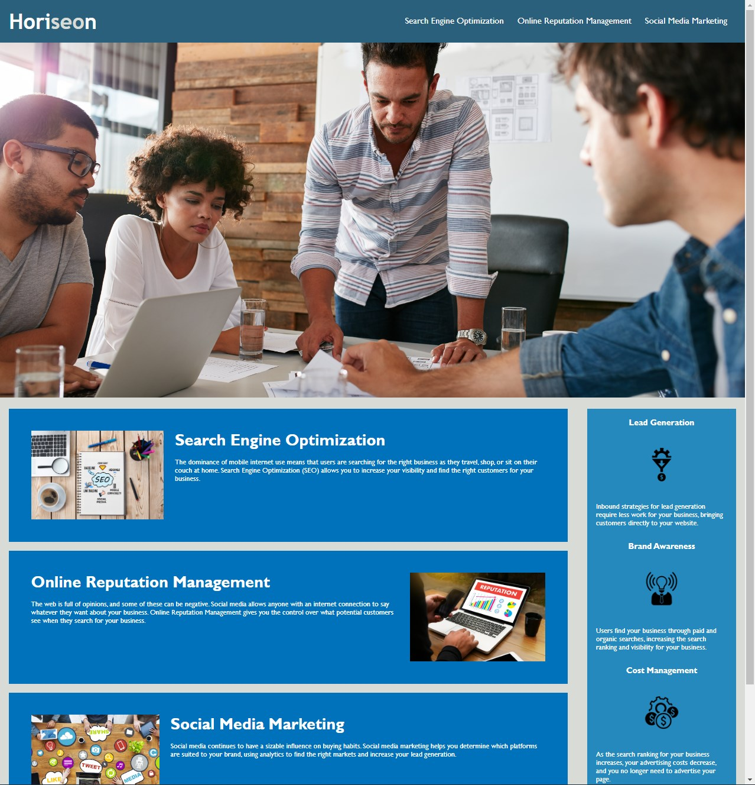

# Week 1 Challenge - Refactor

## Description
This week's challenge was to refactor the provided code in order to make it more accessible. This was achieved by adding alt text to the images on the page to optimise it for search engines. CSS efficiency was improved by consolditating certain selectors and properties and was restructured to follow the semantic structure of the HTML elements. 

## Screenshot

##  Link to completed challenge
